# Window Layouts for macOS

### Your Workspace, Organized Your Way!

Window Layouts is a native macOS utility for quickly arranging application
windows. Apply a layout from the menu bar, assign global keyboard shortcuts, or
enable optional visual controls for a more direct workflow across one or more
displays.

Window Layouts is built with SwiftUI and AppKit and uses only public macOS APIs.
It has no third-party dependencies, telemetry, or analytics.

## Video tour

[](https://youtu.be/6wLCbmWimqQ)

Watch the [Window Layouts for macOS video tour](https://youtu.be/6wLCbmWimqQ)
for a guided demonstration of layouts, custom groups, keyboard shortcuts,
multi-display workflows, drag targets, and configuration options.

## Features

- Arrange windows into halves, quarters, thirds, and two-thirds, or center,
  maximize, and restore them.
- Create up to 20 custom layouts on a flexible 24 × 12 grid and organize them
  into named, reorderable groups.
- Export custom layouts and groups to a portable JSON file, then import them on
  another Mac or after reinstalling macOS.
- Move windows between displays while preserving recognized layouts or
  proportional free-form positioning.
- Fill a target display with all eligible visible windows using a built-in or
  custom layout group.
- Assign configurable global keyboard shortcuts to layouts, groups, window
  actions, and display actions.
- Adjust edge-aware padding from 0 to 200 logical points.
- Access layouts from the menu bar and, optionally, from the Dock menu.
- Enable an optional layout panel near a window's green button without
  modifying the title bar or replacing Apple's window controls.
- Enable optional input-transparent drag targets with live layout previews.
- Launch automatically at login using the public Service Management API.
- Check the public GitHub repository for stable updates and securely install a
  newer signed and notarized release from the About tab.
- Save the layout library safely in Application Support, with automatic
  fallback to defaults if the saved file becomes unreadable.

## Feature tour

### Apply layouts from anywhere

| Menu bar | Green-button panel | Dock menu |
| --- | --- | --- |
| 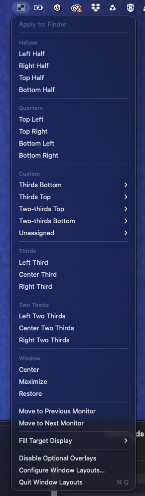 | 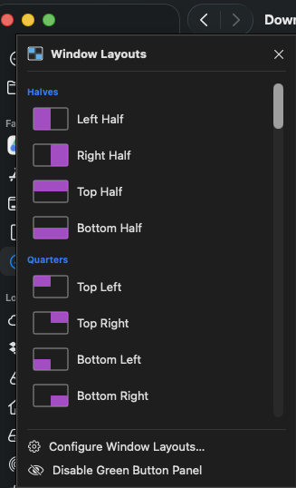 | 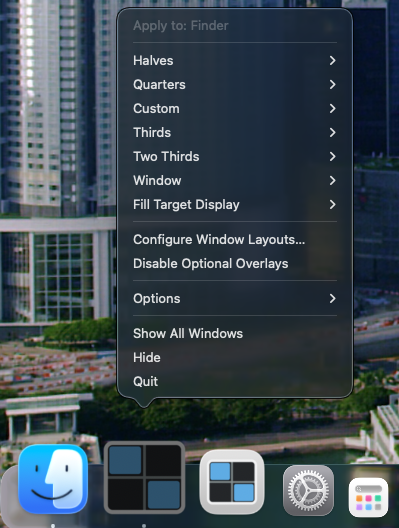 |
| The always-available menu-bar item applies layouts, moves windows between displays, fills a display, and provides the emergency overlay controls. | Optionally hover over a window's green button to open a visual layout chooser without modifying the title bar. | Enable the Dock icon to access layouts and window actions from its standard macOS context menu. |

### Create a workspace that fits you

| Custom layouts | Custom groups |
| --- | --- |
| 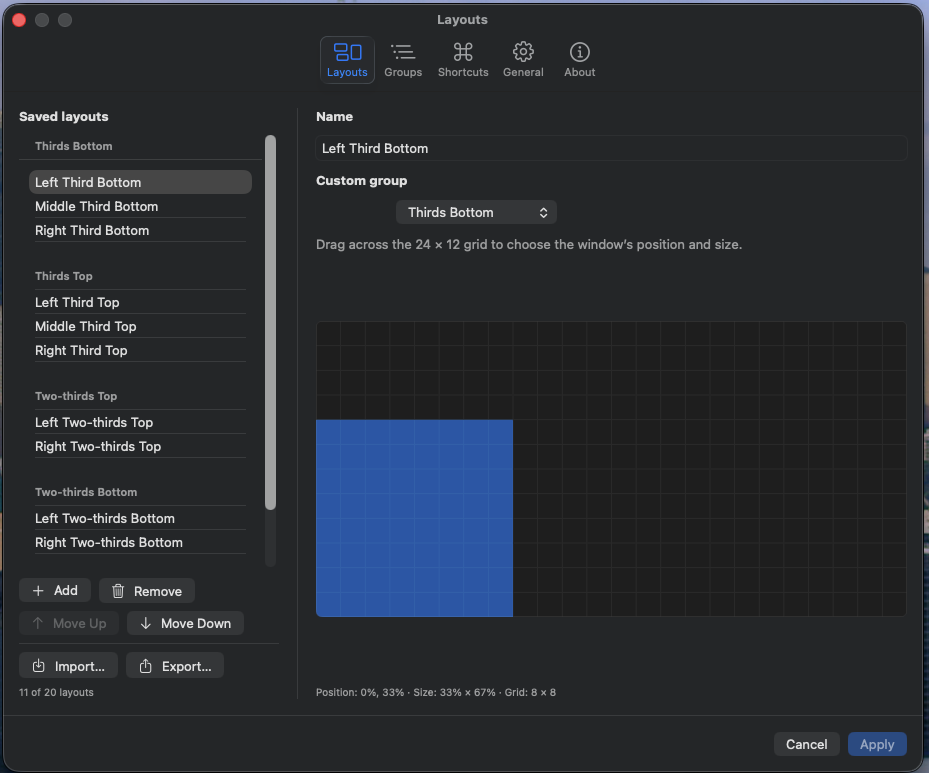 | 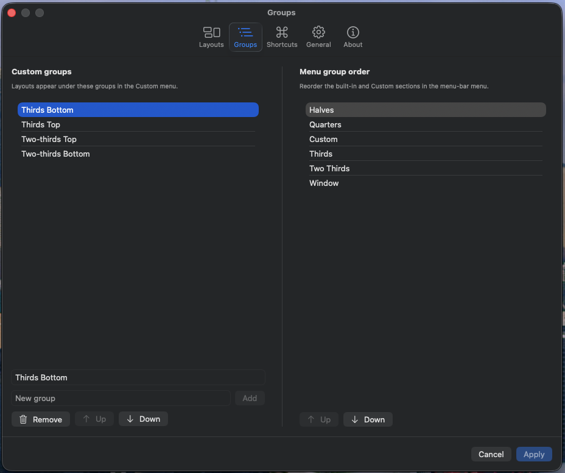 |
| Draw layouts on a flexible 24 × 12 grid, assign them to groups, and import or export the collection as portable JSON. | Organize custom layouts into named groups and reorder both custom groups and the main menu sections. |

| Keyboard shortcuts | General controls | About and updates |
| --- | --- | --- |
| 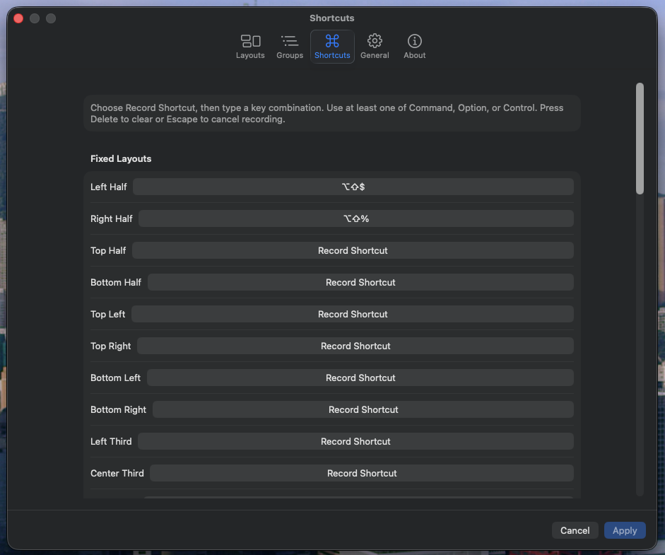 | 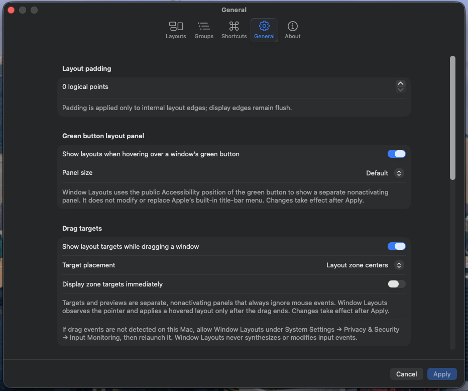 | 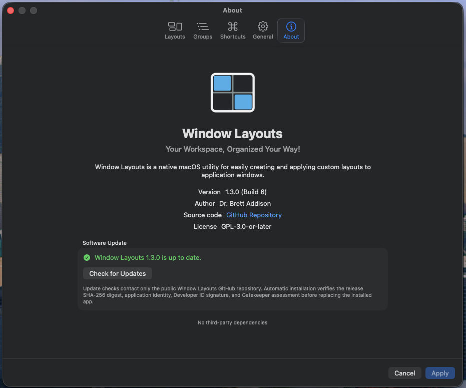 |
| Assign global shortcuts to fixed and custom layouts, monitor movement, display filling, and other window actions. | Tune edge-aware padding and enable the optional green-button panel, Dock icon, or input-transparent drag targets. | Review the installed version and author information, visit the source repository, and securely check for signed stable updates. |

### Arrange windows by dragging

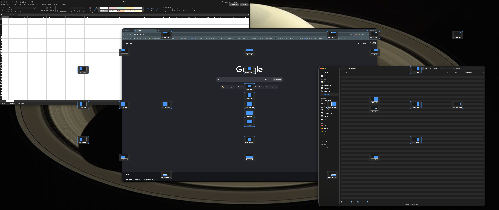

Immediate mode displays the available drop targets as soon as a window begins
moving, placing each target according to the layout it represents.

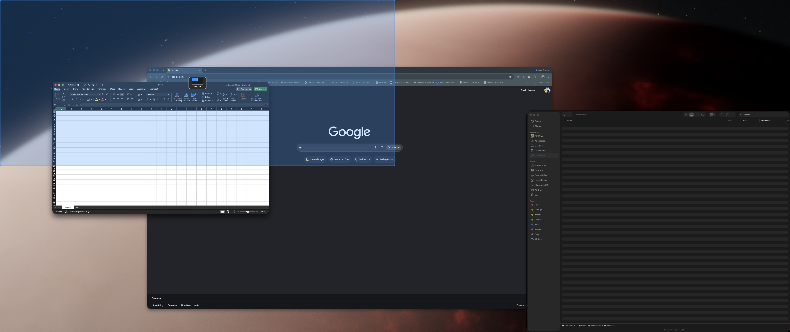

Proximity mode keeps the interface quiet until the pointer approaches a target,
then shows a live preview of the window's destination.

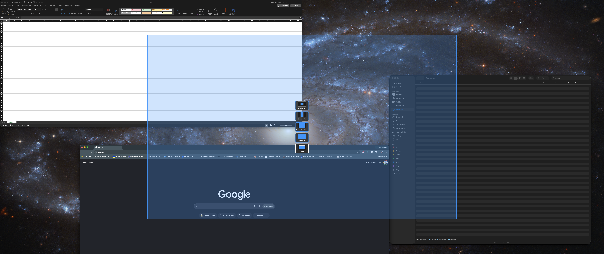

Related layouts can appear as a compact target stack, revealing more choices
only when they are needed.

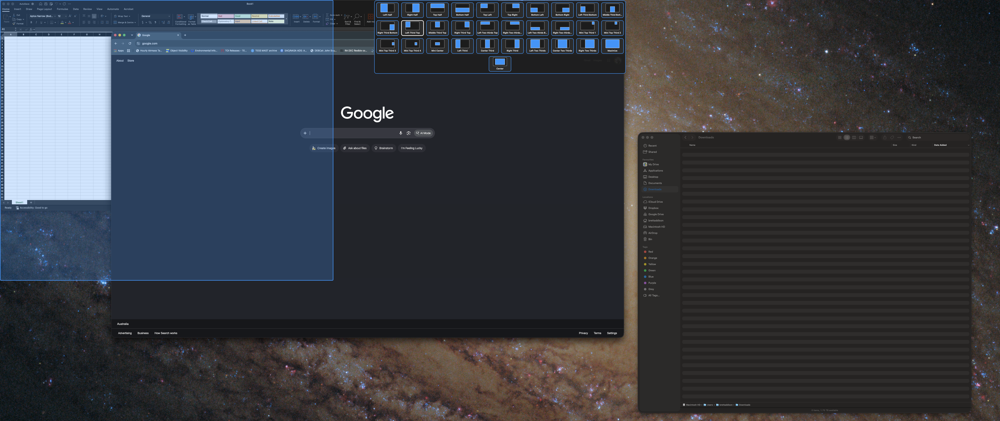

The optional top panel gathers layouts into one compact chooser while the
input-transparent preview shows the exact area the dragged window will occupy.

## Requirements

- macOS 14.6 or later.
- Accessibility permission to discover, move, and resize windows in other
  applications.
- Input Monitoring permission may be needed for optional drag targets on some
  macOS installations.

## Installation

Window Layouts does not require Xcode. To install the signed and notarized app:

1. Download the latest `Window-Layouts-VERSION-macOS.dmg` from
   [GitHub Releases](https://github.com/baddison2005/window-layouts-macos/releases/latest).
2. Open the DMG and drag **Window Layouts.app** onto the **Applications**
   shortcut.
3. Eject the Window Layouts disk image, then open **Window Layouts** from the
   Applications folder.
4. Follow the onboarding prompt to grant Accessibility access in **System
   Settings → Privacy & Security → Accessibility**.

After installation, choose **Configure Window Layouts… → About → Check for
Updates** to check GitHub and securely install newer releases. Update checks
occur only when requested. The notarized ZIP in each release is also available
for users who prefer manual installation:
expand the ZIP, move **Window Layouts.app** into `/Applications`, and launch it
from there. When upgrading, quit the installed app before replacing it. Window
Layouts never asks users to bypass Gatekeeper or disable macOS security.

### Homebrew

Window Layouts is also available from the project's Homebrew tap:

```bash
brew tap baddison2005/tap
brew install --cask window-layouts
```

Use `brew update` followed by `brew upgrade --cask window-layouts` to install a
new release through Homebrew.

### MacPorts

A Window Layouts port has been
[submitted to MacPorts](https://github.com/macports/macports-ports/pull/34326).
Installation instructions will be added here once the port has passed upstream
review and entered the MacPorts ports index.

Window Layouts does not use private APIs or attempt to bypass macOS privacy
controls. Grant access only through the app's onboarding prompt or in **System
Settings → Privacy & Security → Accessibility**.

## Getting started

1. Launch Window Layouts and grant Accessibility access when prompted.
2. Select the Window Layouts icon in the menu bar.
3. Choose a layout to apply it to the window named at the top of the menu.
4. Choose **Configure Window Layouts…** to customize layouts, groups, padding,
   shortcuts, and optional controls.

Settings changes remain in a draft until **Apply** is selected. **Cancel** or
closing the Settings window discards unapplied changes.

To transfer custom layouts, open **Configure Window Layouts… → Layouts** and
choose **Export…**. On the destination Mac, choose **Import…**, review the
replacement confirmation, and select **Apply**. Import replaces only the custom
layouts and groups in the current Settings draft; unrelated preferences and
valid shortcuts are preserved.

The green-button panel, Dock icon, and drag targets are disabled by default and
can be enabled under **General**. The menu bar remains available as an emergency
path for disabling optional panels. All drag targets and previews ignore mouse
events, so invisible or screen-sized overlays never intercept input.

To arrange multiple windows at once, choose **Fill Target Display** and select a
layout group. The target window determines which display is filled. Minimized,
native full-screen, immovable, off-display, and other-Space windows are left
unchanged.

## Platform boundaries

Window Layouts cannot move third-party windows between Spaces because macOS does
not provide a supported public API for that operation. It also does not modify
application title bars or suppress Apple's standard green-button menu.

Some applications expose limited or nonstandard Accessibility information. In
those cases, particular windows or controls may not be available to Window
Layouts.

## Privacy

Window Layouts contains no telemetry or analytics. Its privacy-redacted logs do
not record window titles, document paths, typed keys, or shortcut contents.

The App Sandbox is disabled because controlling other applications through the
public Accessibility client API is central to the app. Release builds use the
Hardened Runtime and are signed and notarized with Apple.

## Build and test

Open `WindowLayouts.xcodeproj` in Xcode 26.6 or run:

```bash
xcodebuild test \
  -project WindowLayouts.xcodeproj \
  -scheme WindowLayouts \
  -destination 'platform=macOS,arch=arm64' \
  CODE_SIGNING_ALLOWED=NO
```

There are no third-party dependencies. Developer ID signing, notarization,
stapling, repeatable ZIP and DMG packaging, and fresh-user installation are
documented in [`docs/DISTRIBUTION.md`](docs/DISTRIBUTION.md).

When developing in Xcode, quit any previously running copy before launching a
new build. Multiple copies can issue competing window movements.

## Fedora/KDE edition

A Fedora/KDE Plasma implementation of Window Layouts is maintained separately
at [baddison2005/window-layouts-kde](https://github.com/baddison2005/window-layouts-kde).

## License

Window Layouts is licensed under the
[GNU General Public License v3.0 or later](LICENSE).
