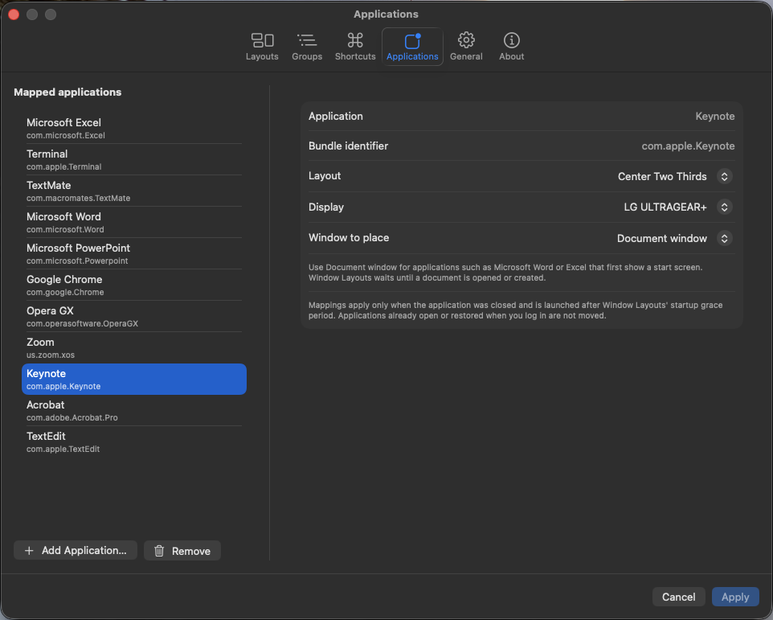

# Window Layouts Experimental for macOS

### Your Workspace, Organized Your Way!

> [!CAUTION]
> This experimental edition contains an unsupported, opt-in prototype for moving a window
> between macOS Spaces. It has a separate app identity and settings library and
> will not replace or update the stable Window Layouts app.

Window Layouts Experimental is a native macOS utility for arranging application
windows. It includes the stable layout, display-transfer, fill-display,
green-button panel, drag-target, Dock-menu, and global-shortcut features, plus a
guarded experiment that asks macOS to carry the active window to the previous or
next Space.

The app uses SwiftUI, AppKit, the public Accessibility API, and public Quartz
event APIs. It has no third-party dependencies, telemetry, or analytics. It does
not use private Spaces APIs or bypass macOS privacy controls.

## Install the experimental edition

Download either artifact from the official experimental GitHub release:

- **DMG:** open it and drag **Window Layouts Experimental.app** to Applications.
- **ZIP:** extract it and move **Window Layouts Experimental.app** to Applications.

The app and DMG are signed with Developer ID and notarized by Apple. Launch the
copy in Applications, then grant **Window Layouts Experimental** Accessibility
and Input Monitoring access when prompted. Quit the stable app while testing so
the two editions do not compete for the same shortcuts or window events.

The minimum supported version is macOS 14.6. Both Apple silicon and Intel Macs
are included in the universal application.

## Isolation from the released app

The experimental build uses:

- the product name **Window Layouts Experimental**;
- bundle identifier `com.astrobrett.WindowLayouts.Experimental`;
- a separate Application Support directory and settings library;
- a separate Accessibility/Input Monitoring identity; and
- a separate experimental update channel and automatic installer that can
  neither offer nor replace the stable app.

Quit the released Window Layouts app while testing this build so two copies do
not register overlapping shortcuts or react to the same window action.

## How experimental Space movement works

macOS does not provide a public API for assigning another application's window
to a Space. This prototype reproduces the user gesture through public Quartz
events: it briefly holds a verified noninteractive point in the active window's
title bar while sending Control–Left Arrow or Control–Right Arrow.

The prototype:

- requires explicit opt-in and confirmation of the Mission Control shortcuts;
- requires macOS Accessibility and input-event posting permission;
- waits until real mouse buttons and modifier keys have been released;
- rejects minimized, nonstandard, immovable, obscured, or unsafe target windows;
- releases every synthetic key and mouse button after success or failure; and
- restores the pointer to its original location.

There is no public way to verify which Space contains a third-party window, so
the app can report only that the gesture was requested. Behavior can vary by app
and may stop working after a macOS update. Some applications expose incomplete
or misleading title-bar Accessibility information. Space movement may therefore
fail, activate an unexpected title-bar control, or produce other unexpected
behavior. Native full-screen windows are not supported.

### Adobe Acrobat Space movement

Version 1.4.2 fixes Space movement for tested Adobe Acrobat windows. Acrobat's
custom title bar does not implement Accessibility hit testing, so Window Layouts
uses a narrow point near the left edge, just below and clear of the close button.
When hit testing is unavailable, a guarded fallback checks the public macOS
window list to confirm that Acrobat is frontmost and the target point is not
covered by another window. It excludes the Dock's full-display bookkeeping
window from that obstruction check.

The gesture holds the left mouse button while sending Control–Left Arrow or
Control–Right Arrow, then releases input and restores the pointer. Acrobat
versions or window types with different title bars may still need additional
handling. Please report failures through
[GitHub Issues](https://github.com/baddison2005/window-layouts-macos/issues),
including your macOS and Acrobat versions and the diagnostic messages.

## Portable custom layouts

Settings → Layouts includes **Export…** and **Import…** controls for moving
custom layouts and groups between Macs or restoring them after reinstalling
macOS. The JSON archive preserves layout and group identifiers. Importing edits
only the current Settings draft and does not save anything until **Apply** is
clicked. Preferences and unrelated shortcuts are preserved; shortcuts referring
to custom items absent from the imported archive are removed.

## Automatic application layouts



Open **Configure Window Layouts Experimental… → Applications** to map an
application to a built-in or custom layout on a specific display. The mapping
runs only after a fresh application launch, not when another instance is
already running. A 30-second startup grace period prevents the feature from
rearranging windows that macOS restores when Window Layouts launches at login.

For applications such as Microsoft Word and Excel that begin with a file or
template chooser, select **Wait for a document window**. Window Layouts then
waits until a file is opened or a new document is created before applying the
layout. Keynote receives additional handling for its multi-step launch flow:
the app ignores the Open and theme choosers, waits through modal conversion
warnings, recognises the completed slide editor, and allows Keynote's own
launch-time resizing to settle before enforcing the selected layout. This
supports both newly created presentations and converted PowerPoint files.

Some applications expose limited or nonstandard Accessibility information, so
automatic mapping may not work for every application or window type. Please
report failures through
[GitHub Issues](https://github.com/baddison2005/window-layouts-macos/issues) or
contact the developer through the repository, including the application name,
version, and whether a launcher, chooser, warning, or document window appeared
first. App-specific public-Accessibility workarounds can then be investigated
without using private APIs.

The About tab checks only official experimental-channel releases. Downloads
are validated independently from the stable app and retain this edition's
separate bundle identifier, install path, permissions, and settings.

## Build and configure

1. Open `WindowLayouts.xcodeproj` from this experimental worktree in Xcode.
2. Select your development team and run **WindowLayouts**.
3. Grant **Window Layouts Experimental** access when macOS requests it. If
   needed, check **System Settings → Privacy & Security → Accessibility** and
   **Input Monitoring**.
4. In **System Settings → Keyboard → Keyboard Shortcuts → Mission Control**,
   enable **Move left a space** and **Move right a space** as Control–Left Arrow
   and Control–Right Arrow.
5. Open **Configure Window Layouts Experimental… → General**, enable the
   experimental feature, confirm those Mission Control shortcuts, and choose
   **Apply**.
6. In **Shortcuts**, assign different trigger combinations to **Move Window to
   Previous Space** and **Move Window to Next Space**. Do not assign the raw
   Control-arrow combinations, because Mission Control needs them internally.

The actions are also available from the menu bar, Dock menu, and green-button
panel when the experiment is enabled and permissions are granted.

Run the test suite without posting any real input events:

```bash
xcodebuild test \
  -project WindowLayouts.xcodeproj \
  -scheme WindowLayouts \
  -destination 'platform=macOS,arch=arm64' \
  CODE_SIGNING_ALLOWED=NO
```

## Other safety boundaries

Window Layouts never modifies application title bars. Optional drag targets and
previews are nonactivating panels with `ignoresMouseEvents = true`; hidden or
screen-sized overlay windows cannot accept input. The menu-bar item remains the
emergency path for disabling optional overlays.

### Terminal window sizing

Terminal may make a window slightly narrower or taller than the requested
layout because it normally resizes in whole character columns and rows. To let
Terminal windows conform precisely to layouts, open **Terminal → Settings →
Profiles**, select each profile you use, choose **Window**, and enable **Smooth
resize**. The setting applies to new windows, so open a new Terminal window
after enabling it. See Apple's [Terminal profile window
settings](https://support.apple.com/en-au/guide/terminal/trmlwindw/mac).

The App Sandbox is disabled because controlling other applications through the
Accessibility API is central to the prototype. Only artifacts attached to the
GitHub experimental release should be treated as signed and notarized distribution builds.

## Stable and Fedora/KDE editions

- Stable macOS edition: [baddison2005/window-layouts-macos](https://github.com/baddison2005/window-layouts-macos)
- Fedora/KDE Plasma edition: [baddison2005/window-layouts-kde](https://github.com/baddison2005/window-layouts-kde)

## License

Window Layouts is licensed under the
[GNU General Public License v3.0 or later](LICENSE).
